# CRinMI_MR
__Team [Master Rise]__ - 2024 Manufacturing Process Competition Repository

# Competition Details
- __Team Members__:
  - __Jongsoo Han(Team Leader)__ - jongsoo@g.skku.edu
  - __Jaeseog Won__ - jaeseogwon@g.skku.edu
  - __Gunwoo Kim__ - kkwkmw@g.skku.edu
- __Competition Date__: August 30, 2024 (Friday)
- __Preliminary Training__: July 30 - July 31, 2024
- __Preparation Period__: August 1 - August 29, 2024
- __Competition Venue__: Robot Plus Test Field, 730 Suseo-dong, Gangnam-gu, Seoul, South Korea

# Hardware
- __Robot Manipulator__: Rainbow Robotics RB10
- __RGB-D Camera__: RealSense D415
- __Laptop__: MSI GF76 B13VFK

# System Environment
- __OS__: Ubuntu 20.04
- __Middleware__: ROS1

# Workflow

  <table>
    <tr>
      <td align="center">
        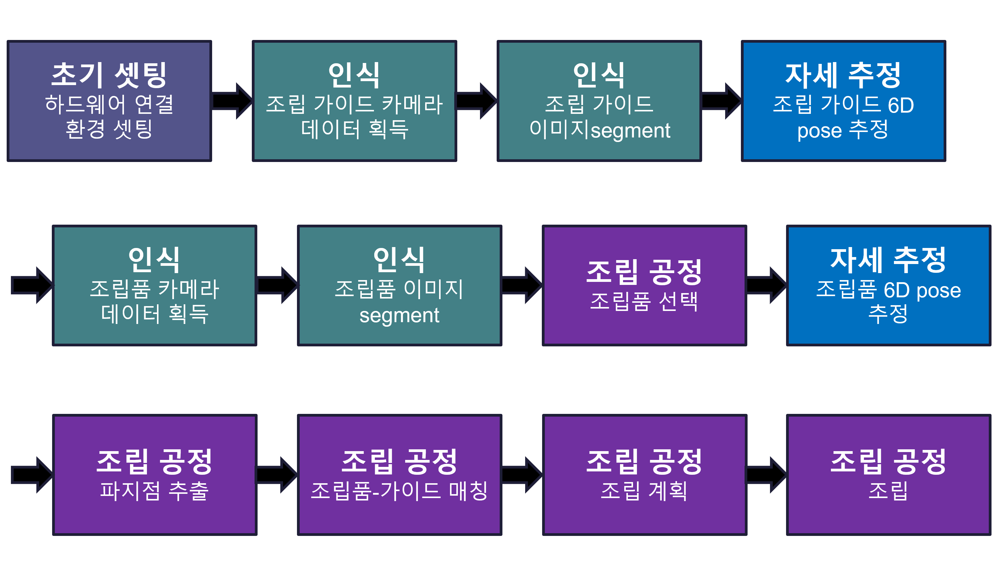
      </td>
    </tr>
  </table>

# System Overview
- The entire system is modularized, implementing each function required for the manufacturing process.

## Key Modules
### 1. robot_interface (Maintainer: Jaeseog Won)
- Manages the robot SDK and gripper SDK
- Develops process-specific SDKs

### 2. calibrate_interface (Maintainer: Gunwoo Kim)
- Uses ARUCO markers for camera-robot calibration
- Manages and refines calibration data

  <table>
    <tr>
      <td align="center">
        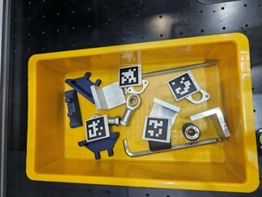
      </td>
    </tr>
  </table>

### 3. segment_interface (Maintainer: Jaeseog Won)
- Performs object segmentation using YOLO V8
- Applies post-processing to segmentation results

  <table>
    <tr>
      <td align="center">
        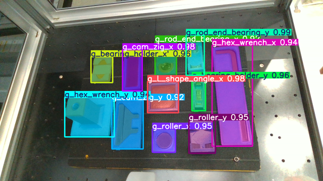
      </td>
      <td align="center">
        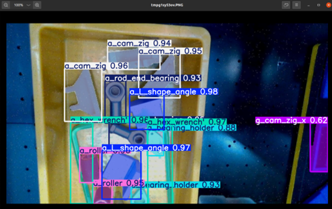
      </td>
      <td align="center">
        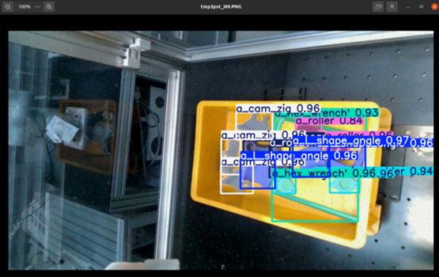
      </td>
    </tr>
    <tr>
      <td align="center">
        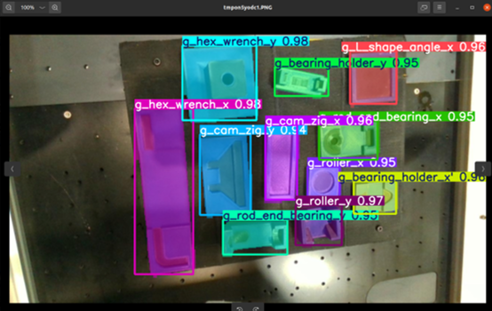
      </td>
      <td align="center">
        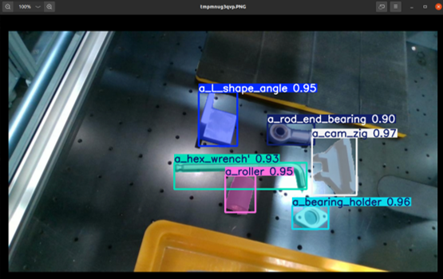
      </td>
      <td align="center">
        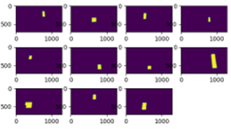
      </td>
    </tr>
  </table>

### 4. tf_interface (Maintainer: Jongsoo Han)
- Manages ROS TF data
- Publishes transformations between frames
- Computes relationships between TF frames

### 5. assemble_interface (Maintainer: Jongsoo Han)
- Predicts 6D poses of objects using ICP (Iterative Closest Point)

  <table>
    <tr>
      <td align="center">
        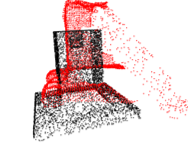
         <b>Before ICP</b>
      </td>
      <td align="center">
        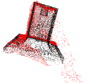
         <b>After ICP</b>
      </td>
    </tr>
  </table>

  <table>
    <tr>
      <td align="center">
        
         <b>Real time 6D Pose result</b>
      </td>
    </tr>
  </table>

### 6. camera_interface (Maintainer: Jongsoo Han)
- Handles camera image acquisition and ROS-to-CV conversion
- Converts depth images to point clouds
- Visualizes image data

  <table>
    <tr>
      <td align="center">
        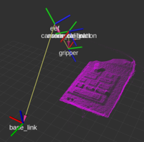
      </td>
    </tr>
  </table>

### 7. visualize_interface (Maintainers: Jongsoo Han, Gunwoo Kim)
- Visualizes the entire process in RViz
- Displays 6D pose-calculated meshes
- Highlights target areas and danger zones

  <table>
    <tr>
      <td align="center">
        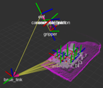
      </td>
    </tr>
  </table>

